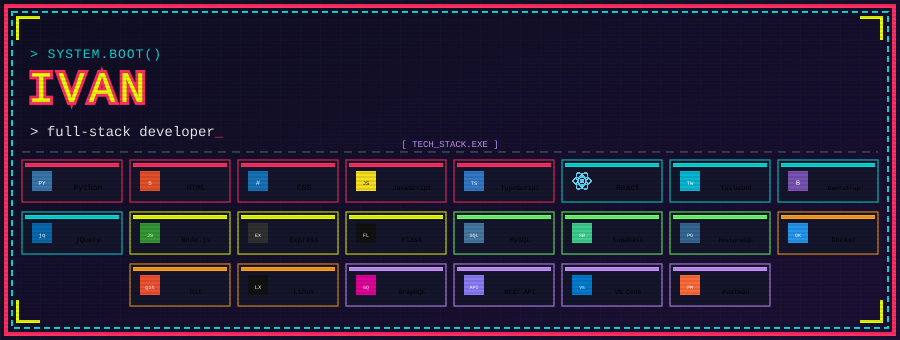

<div align="center">



# Ivan

` Software Developer `

<br>

👋 Hey! I'm **Ivan** — a software developer and student who likes building things, experimenting with technology, and occasionally breaking everything in the process.

I'm mainly interested in **full-stack development, backend systems, databases, and creating useful web applications**.

</div>

<hr>

<div align="center">

## 📙 Languages and Tools

[](https://www.typescriptlang.org/)
[](https://developer.mozilla.org/en-US/docs/Web/JavaScript)
[](https://reactjs.org/)
[](https://nodejs.org/)
[](https://www.python.org/)
[](https://www.docker.com/)
[](https://www.linux.org/)

</div>

<hr>

<div align="center">

## 🎹 Outside of Code

</div>

When I'm not programming, I'm usually somewhere around **music**.

I play around with **piano, guitar, music theory, and music production** — basically finding new ways to turn my free time into another thing I need to learn.

---

<div align="center">

## 🧠 Currently Learning

```text
┌──────────────────────────────────────┐
│  > React Frontend                    │
│  > NodeJS/.Net Backend               │
└──────────────────────────────────────┘
